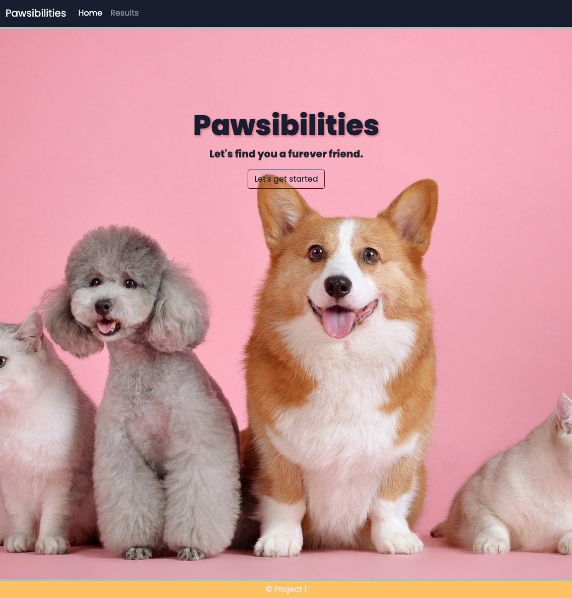
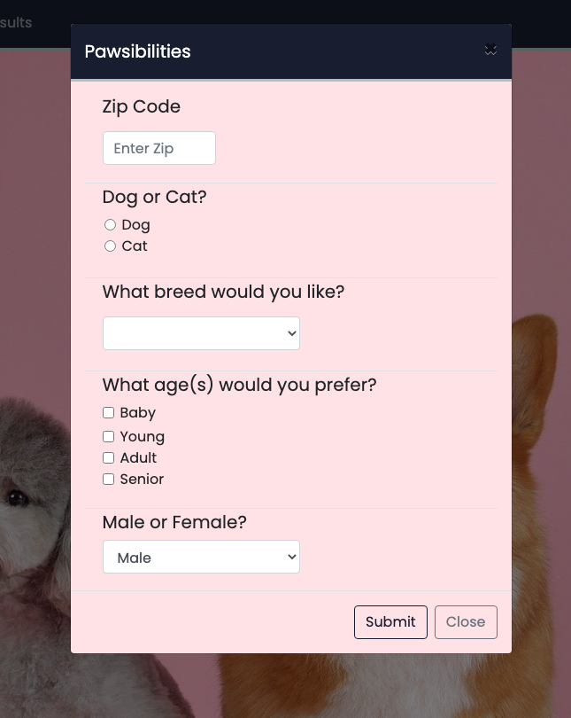

# Pawsibilities - pet finder app
Project 1 - Team 5'

Deployed on Github pages [Pawsibilites-Find your furever friend!](https://cptspooky.github.io/Pawsibility/)

## Introduction
Pawsibilites was created to be a user responsive web application to help its user conveniently search for their next potential pet through animal adoption. The users input will access Petfinder.com API for cats or dogs of all breeds that are available for adoption and will show user a map of the shelters location using MapBox API. This project is created with separate HTML, CSS, and Javascript files.

## Requirements 
* Must use at least two server-side APIs
* OPTIONAL ** Must use a CSS framework other than Bootstrap
* Must be interactive (i.e: accept and respond to user input)
* Use at least one new third-party API
* Must have a polished UI
* Must meet good quality coding standards
* Does not use alerts, confirms or prompts (look into modals)
* Must be deployed to GitHub Pages (edited) 

## Features
* Full responsiveness and browser compatibility 
* Quick ZIP-codes search with the use of a modal
* Use of geocoding to display map 

 

## How to use?
Users are invited to search for their next furever friend by searching their zip code, type of animal (cat or dog), a specific breed, age preference, and gender preference. The users search can be very specific or broad and a list of available pets for adoption will be generated to show a thumbnail image and the name of the pet. Once the pet name is clicked, the chosen pets enlarged picture and detailed information will pop up to the side along with a map of the shelters location. 

## Demo

 

## Technologies Used
* Bootstrap - Used to tie together HTML and CSS by creating an organized responsive styling structure for the site.
* Javascript - Used to dynamically change html and and store user-input. 
* jQuery - Used to populate users search criteria within the API's used.
    * Used as event listeners of parent and children elements. 
    * Used to store the variables in local storage to be dynamically displayed in HTML on the results page. 

## Resources Used
* Stackoverflow
* Mapbox
* PetFinder
* W3Schools
* Bootstrap
* GoogleFonts

